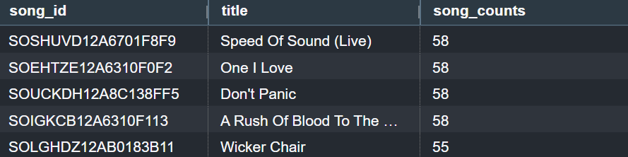
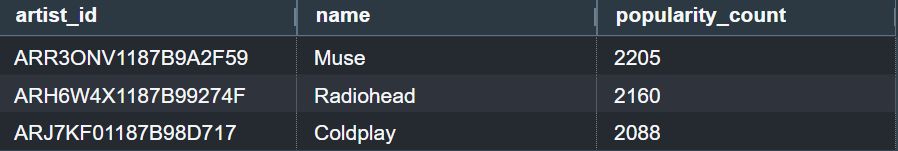

# Data Warehouse
Second project provided by Udacity in the "Data Engineering with AWS" course. 

Sparkify is a music streaming startup, with log and song datasets that have been growing over the time. They want to migrate their data to the cloud. Currently, their data is located in AWS S3. The task of data engineers is to build data pipeline, as part of which the data gets extracted from S3 bucked, gets loaded into staging tables within Redshift and then finally gets uploaded into the final tables within Redshift.

The purpose of this task is to enable better analysis of the users and their music preferences. The data is following the star schema design, which enables an easier querying of the data and improves performance, since Sparkify analysis team will be aggregating large amounts of data during querying. This will let Sparklify to come up with new queries depending on their analytical needs and run them with no issues. As well as that, this structure allows for easy updates and as the user and songs data grows, this schema can handle the changes efficiently. As part of the star schema, there are fact table songplay and dimensional tables song, user_info, artist and time. 'songplay' table stores detailed information about users` interactions with the music platform, 'song' table consists of metadata of each song, 'user_info' includes user information, 'artist' table has details about artists of the provided songs, and 'time' table stores time information about all the user interactions with the platform and is used for time-based analysis. This will minimise the number of joins needed for querying as the information is logically grouped together.

The ETL process designed that way that firstly all the required data from the S3 bucket gets loaded into the staging tables within Redshift. This is an essential step of storing the raw data, and producing cleaning, deduplication, timestamp conversion, etc. if required. After that these staging tables get used to populate the data into the final tables.

The project includes the following files:
- *create_table.py* - where the star schema is created, it consists from fact and dimension tables in Redshift.
- *etl.py* - where data gets loaded from S3 into staging tables on redshift and then gets processed in analytics tables in Redshift.
- *sql_queries.py* - where SQL statements are defined, which then get imported into the *create_table.py* and *etl.py* files.

To run the script, start from running the 'create_tables.py' script, which will create empty staging and final tables with specified columns and column types. Then run etl.py (prepare for it to take a long time to run, depending on your network conditions and cluster configurations), within this script, the data gets loaded from S3 bucket into created earlier staging tables within Redshift, and then the data from the staging tables gets distributed within the final tables. To monitor the process of query creation, you can check *Query Monitoring* tab within the Redshift cluster. 

Once the ETL pipeline is set up, analysis can be performed. AWS Redshift Query Editor V2 can be used to run the queries. Below are a few examples of the possible queries:

** How many songs does an average user listens per session? **

Below query consists of outer query that uses FROM clause to get grouped data from inner query. The inner query counts songs per session for each user, and then the outer query takes an average from the count list. 

'SELECT AVG(counts_per_session) AS avg_count
FROM (
    SELECT session_id,
    count(*) AS counts_per_session
    FROM songplay
    GROUP BY session_id
) AS avg_session_count'

The answer is 15.

** What are the top 5 songs among all users? **

'SELECT s.song_id,
s.title,
COUNT(sp.song_id) AS song_counts
FROM song s
JOIN songplays sp
ON s.song_id=sp.song_id
GROUP BY s.song_id, s.title
ORDER BY COUNT(sp.song_id) DESC
LIMIT 5'

The output is:

** What are top 3 artists? **

'SELECT a.artist_id,
a.name,
COUNT(sp.artist_id) AS popularity_count
FROM artist a
JOIN songplay sp
ON a.artist_id=sp.artist_id
GROUP BY a.artist_id, a.name
ORDER BY COUNT(sp.artist_id) DESC
LIMIT 3'

The output is:

### Steps:
1. Design schemas for the fact and dimension tables.
2. Create these fact and dimension tables in the *sql_queris.py* using CREATE statement.
3. Add SQL DROP statements for the fact, dim and staging tables in the *sql_queris.py*.
4. In *create_tables.py* write logic to connect to the database and create these tables there. Do the following steps:
   - Create a cluster in Redshift
   - Note down the connection information to later add to *create_tables.py*
   - Create a security group to ensure that the Redshift cluster’s security group allows inbound connections from your IP address - need to modify the security group   
     settings to allow connections on port 5439 (Redshift’s default port) from your IP address or your VPC.
6. Write SQL DROP statements for the above tables, add these statements at the start of the *create_tables.py*. This way, if the file will be run again, the database will be reset and ETL pipelines can be tested, without getting an error.
7. After launching Redshift cluster, create an IAM role that has read access to S3.
8. Add information about redshift database and IAM role to *dwh.cfg*.
9. Test that everything is running correctly by running *create_tables.p*y and checking the table schemas in the redshift database. For the testing purposes, Query Editor in the AWS Redshift console can be used.
10. Implement the logic in *etl.py* to load data from S3 to staging tables on Redshift.
11. Implement the logic in *etl.py* to load data from staging tables to analytics tables on Redshift.
12. Test by running *etl.py* after running *create_tables.py* and running the analytic queries on the created Redshift database to compare the outputs with the expected results.
13. Delete the redshift cluster when finished to avoid extreme costs.
14. Discuss the purpose of this database in context of the startup, Sparkify, and their analytical goals.
15. State and justify your database schema design and ETL pipeline.
16. Provide some queries and results for song play analysis.

*Note that when Redshift cluter is deleted all the created tables get deleted as well.*
